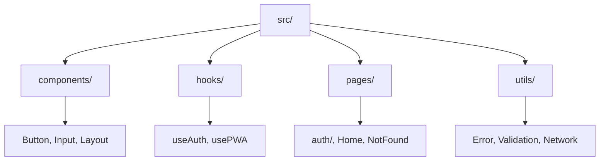

<div align="center">

# 🚀 React + Supabase Template

### ⚡ Template base per applicazioni React con autenticazione Supabase

[](https://react.dev)
[](https://vitejs.dev)
[](https://supabase.com)
[](https://tailwindcss.com)

---

**🎯 Template pulito e moderno per iniziare rapidamente con React, Supabase, Vite e Tailwind CSS. Include autenticazione completa e struttura base per nuove applicazioni.**

</div>

## ✨ Caratteristiche

<table>
<tr>
<td width="50%">

### 🔐 Autenticazione
- 🔑 **Login/Registrazione** con email
- 🌐 **Google OAuth** integrato
- 🔒 **Protezione rotte** automatica
- 👤 **Gestione profili** utente
- 🔄 **Reset password** completo

</td>
<td width="50%">

### 🛠️ Tecnologie
- ⚡ **React 19** con Vite
- 🎨 **Tailwind CSS** per styling
- 🗄️ **Supabase** per backend
- 📱 **PWA Ready** per mobile
- 🚀 **Deploy** su Vercel

</td>
</tr>
</table>

## 🚀 Quick Start

```bash
# Clone e setup
git clone https://github.com/your-username/react-supabase-template.git
cd react-supabase-template
pnpm install
cp .env.example .env
pnpm dev
```

<div align="center">

**🎉 Disponibile su `http://localhost:5173`**

</div>

## 📁 Struttura



## 🛠️ Tech Stack

<div align="center">

| 🎨 Frontend | 🔧 Backend | 🚀 Deploy |
|:---:|:---:|:---:|
| React 19 | Supabase | Vercel |
| Vite | PostgreSQL | GitHub Actions |
| Tailwind | Auth | PWA Ready |

</div>

## 📋 Script

```bash
pnpm dev      # Sviluppo
pnpm build    # Build produzione  
pnpm preview  # Preview build
pnpm lint     # Linting
```

## 🔧 Configurazione

1. **Supabase**: Crea progetto e copia URL + Key
2. **Google OAuth**: Configura in Google Cloud Console (opzionale)
3. **Environment**: Modifica `.env` con le tue credenziali
4. **Database**: Configura le tabelle necessarie per la tua app

## 📱 PWA Features

- ✅ Installabile su mobile/desktop
- ✅ Offline support
- ✅ Push notifications
- ✅ App-like experience

---

<div align="center">

**⭐ Se ti piace il template, lascia una stella!**

[](https://github.com/your-username/react-supabase-template)
[](https://github.com/your-username/react-supabase-template)

</div>